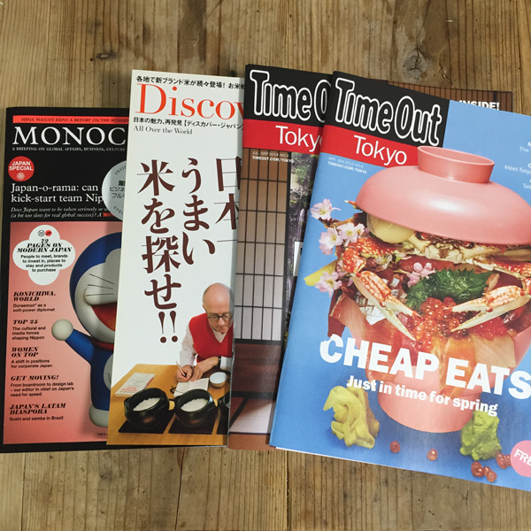
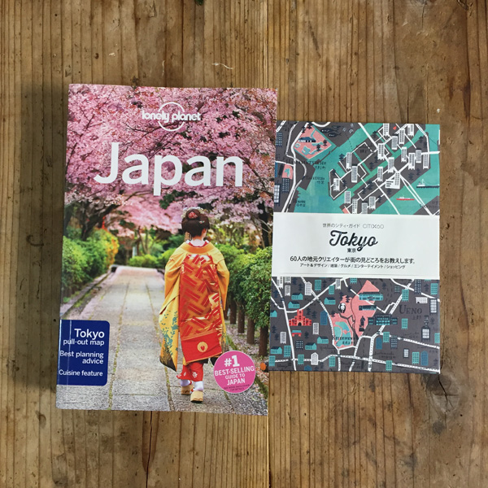
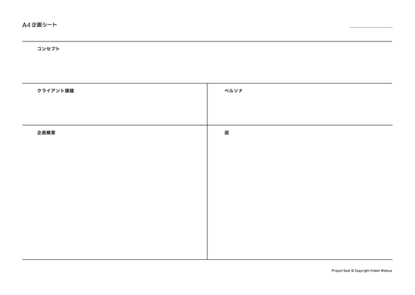
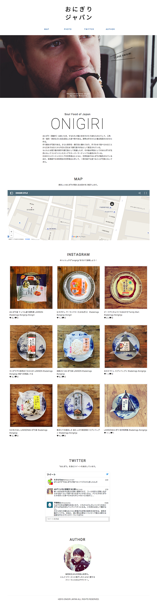

# seika151019


---

##スケジュール
--  
#####1日目 
- **自己紹介**
- **授業全体の話**
- **リサーチ&SNSの使い方**
  - SNSの使い方紹介
  - お題
  - 代表的なSNSを使ってみる
- **お題**
  - サンプル
- **ブレインストーミング**
  - 企画を考えよう
  - ドメインを探そう！
- **デザインをする**

※2日目の授業前までにテーマを提出

--  
#####2日目 
- **サイトを編集する**
  - Atom
  - HTML、jQuery
  - プラグイン変更方法
  - googleマイマップ
  - instagram
  - Twitter
  
--  
#####3日目
- **発表**

---

##1日目

###講師自己紹介

本末英樹（モトスエヒデキ）  
Webデザイナー


####最近のお仕事

**Tadaima Japan**  
[http://tadaimajp.com/](http://tadaimajp.com/)

**docomyanmar**  
[http://docomyanmar.com/popamt/](http://docomyanmar.com/popamt/)


###リサーチ&SNSの使い方


####SNSの使い方紹介
- Twitter検索
- Instagram検索
- Google Map検索
- pinterest
- poket
- feedly
- はてぶ
- delicious
- Evernote
- youtube
- Foursquare

どこまでしってるかな？？

--

####お題
#####外国人向けに日本の観光スポットを俺視点で紹介

2014年、ついて訪日観光客が1,000万人を超えた。（1341万人）
今年は一気に2000万人を突破するかも？！  
ビザの緩和、円安もあり、オリンピックに向けて、更に加速する日本観光。  


韓国（275万）、中国（240万）、台湾（282万）  
イギリス（22万人）、フランス（17万人）、ドイツ（14万人）  
アメリカ（89万人）、カナダ（17万人）


日本が今、海外から注目されている！

- [Clean Bandit クリーン・バンディット](https://www.youtube.com/watch?v=m-M1AtrxztU&index=28&list=PL6rg8Zb6t-fKr3taJTwYya-KB9f_NBvNZ)  
曲：Rather Be（日本で撮影されたPV）
- ベビーメタル、きゃりーぱみゅぱみゅ
- 抹茶キットカット


##「俺、私的観光スポットガイドサイトを作る」
外国人向けに日本の観光スポットモノを俺/私の視点で紹介する。  
ありきたりな環境スポットではなく、みんなが知らないところ、あっと驚くような場所をネットで調べて紹介する。

サンプルサイト  
**おにぎりジャパン**  
[http://onigirijp.com/](http://onigirijp.com/)


--

#### 代表的なSNSを使って見る

Googlemap、Instagram、Twittwrを使って検索してみよう！


--

#####googlemap

(例)

- 軍艦島
- パックマン
- ポケモンチャレンジ
- googlemapでも火星や月が見れる
- [group_inou / EYE (PV)](https://goo.gl/ELefFi)  


[ストリートビュー](https://www.google.co.jp/intl/ja/maps/streetview/)


--

#####Instagram

(例)

- [まるたろう  ](https://instagram.com/marutaro/)
- [沼サンド](https://instagram.com/yuki0207float/)
- [ハムスター「Darcy」](https://instagram.com/darcytheflyinghedgehog/)
- [小籔千豊](https://instagram.com/koyabukazutoyo_shinkigeki/)

圧倒的女子力!?　小籔千豊のInstagramがじわじわ来る  
[https://instagram.com/koyabukazutoyo_shinkigeki/](https://instagram.com/koyabukazutoyo_shinkigeki/)  
小籔さんは、なんと最近女性誌の専属モデルになったことでも話題になっているんです。しかも、「NYLON JAPAN」「ViVi」「VOCE」の3誌同時に  
カズニョロポーズ


--

#####Twitter

(例)

- 完全に一致
- ツイッター担当者にニワトリを起用　豪チェーン店  
ニワトリのツイートが話題に＝チキン・トリートから  
[https://twitter.com/chickentreat](https://twitter.com/chickentreat)  
[http://www.chickentreat.com.au/](http://www.chickentreat.com.au/)


--

#####Google

Google トレンド - 急上昇ワード  
[https://www.google.com/trends/hottrends/visualize?pn=p4&hl=ja&nrow=5&ncol=5](https://www.google.com/trends/hottrends/visualize?pn=p4&hl=ja&nrow=5&ncol=5)

Google検索がもっと便利になる検索オプション・テクニックまとめ  
[http://liginc.co.jp/web/service/google/86222](http://liginc.co.jp/web/service/google/86222)

ブラウザ上でブロック崩し？Google検索の面白い「隠しコマンド」まとめ  
[http://liginc.co.jp/184484](http://liginc.co.jp/184484)


--

####代表的な訪日外国人用の観光サイト

**Time Out Tokyo**  
[http://www.timeout.jp/tokyo/ja](http://www.timeout.jp/tokyo/ja)

**IS JAPAN COOL**  
[https://www.ana-cooljapan.com/](https://www.ana-cooljapan.com/)


--

####代表的な訪日外国人用の観光ガイドブック




- TimeOUT tokyo
- Discover Japan
- Monocle
- lonely planet


--

####他にも

**YOUは何しに日本へ？**  
[http://www.tv-tokyo.co.jp/youhananishini/](http://www.tv-tokyo.co.jp/youhananishini/)


サイトやガイドブックに載っていないような  
面白いスポットやモノを世界に発信しよう！


---


###ブレインストーミング
チームでアイデアを出し合おう

お弁当、ハローキティ、ラーメン、盆栽...  
いろんな日本が海外で流行っている。

何が流行っているか調べよう！  
はやっていないものを見つけよう！

観光スポットについては、グループでブレスト。  
地元ネタでもOK。アイデアは一人5個x4人。


--

####ドメインを探そう！

Webサービス作る時は、ドメイン名（URLアドレス）が取得できるかどうかも大事。

**ドメインとは**  
インターネット上にあるコンピューターを特定するために使われるもの

**ムームードメイン**  
ドメインを取得できる会社
[https://muumuu-domain.com/](https://muumuu-domain.com/)

```
「onigiri」で取得可能だったドメイン
onigirijp.com
onigiri.style
onigiri.school
onigiri.gallery
onigiri.pictures
```


####2日目の授業前までにテーマを提出



###デザインをする



デザインを変更できるポイント

- ロゴ画像の変更
- トップバナーの変更（余裕があれば）
- サイト概要部分の画像変更
- ライター写真画像の変更

その他のデザイン修正は、HTMLとCSSの技術が必要。  
変更したい方は講師に個別で質問してください。

