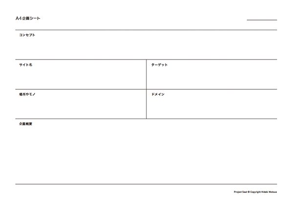

# seika151019


---

#企画内容

##自己紹介

最近のお仕事

**Tadaima Japan**  
[http://tadaimajp.com/](http://tadaimajp.com/)


**docomyanmar**  
[http://docomyanmar.com/popamt/](http://docomyanmar.com/popamt/)


---

##タイトル
俺、私的観光スポットガイドを作る
秘密のスポット教えて

---

##内容
外国人向けに日本の観光スポットを俺視点で紹介する。  
ありきたりな環境スポットではなく、みんなが知らないところ、あっと驚くような場所をネットで調べて紹介する。

---

##目的
- ネットで検索して、面白い、有用なコンテンツを見つける。
- ネットでは一般的な情報だと埋もれてしまうが、スペシャルな情報はみんなに見てもらえる。情報発
信の方法。
- 検索で探す力がネットでは重要

検索能力、情報収集能力みなさんが社会に出たら
必ず役になってくる能力。私自身もすごく感じる。


---

##スケジュール
--  
#####1日目 
- **自己紹介**
- **リサーチ&SNSの使い方**
  - いい情報にたどりつく検索方法紹介
- **SNSの使い方紹介**
- **お題**
  - 参考デザイン
- **ブレスト**
  - ドメインを探そう！
  
※2日目の授業前までにテーマを提出

--  
#####2日目 
- **デザインをする**
- **サイトを編集する**
  - プラグイン変更方法
  - HTML、jQuery
  
--  
#####3日目
- **発表**

---

##1日目
###リサーチ&SNSの使い方
####いい情報にたどりつく検索方法紹介
- 参考サイト紹介。
- 例：pinterestで「Japan」で検索。雑誌で見てからネットで検索。
- 観光スポットについては、グループでブレスト。地元ネタでもOK。アイデアは一人5個x4人。
- 観光スポット例：おたくの聖地。呪われた場所。


#####参考サイト

- googleMapで面白いところを見せる（エロマンガ島？）
- Instagramで面白いところを見せる
- Twitterで面白いところを見せる

Instagram

まるたろう  
[https://instagram.com/marutaro/](https://instagram.com/marutaro/)

沼サンド  
[https://instagram.com/yuki0207float/](https://instagram.com/yuki0207float/)

ハムスター「Darcy」  
[https://instagram.com/darcytheflyinghedgehog/](https://instagram.com/darcytheflyinghedgehog/)

まこ  
[https://instagram.com/ytrpics/](https://instagram.com/ytrpics/)


####SNSの使い方紹介
- Twitter検索
- Instagram検索
- Google Map検索
- pinterest
- poket
- feedly
- はてぶ
- delicious
- Evernote
- youtube
- Foursquare

どこまでしってるかな？？


####お題
#####外国人向けに日本の観光スポットを俺視点で紹介

ついに1000万人を超えた。  
1341万人  
今年は一気に2000万人いきそう  

オリンピックに向けて、更に加速する  
ビザの緩和、円安

韓国（275万）、中国（240万）、台湾（282万）  
イギリス（22万人）、フランス（17万人）、ドイツ（14万人）  
アメリカ（89万人）、カナダ（17万人）


**Time Out Tokyo**  
[http://www.timeout.jp/tokyo/ja](http://www.timeout.jp/tokyo/ja)

**IS JAPAN COOL**  
[https://www.ana-cooljapan.com/](https://www.ana-cooljapan.com/)


変な日本を紹介したものも集めたい。本とかグッズとか
ココらへんに載っていないものを探そう！


地元とか京都とか

YOUは何しに日本へ？  
[http://www.tv-tokyo.co.jp/youhananishini/](http://www.tv-tokyo.co.jp/youhananishini/)

**youtube**   

Clean Bandit
クリーン・バンディット
曲：Rather Be
https://www.youtube.com/watch?v=m-M1AtrxztU&index=28&list=PL6rg8Zb6t-fKr3taJTwYya-KB9f_NBvNZ

ベビーメタル

抹茶キットカット

kickstarter.com  
little witch academia  
https://www.kickstarter.com/projects/1311401276/little-witch-academia-2

圧倒的女子力!?　小籔千豊のInstagramがじわじわ来る  
[https://instagram.com/koyabukazutoyo_shinkigeki/](https://instagram.com/koyabukazutoyo_shinkigeki/)  
小籔さんは、なんと最近女性誌の専属モデルになったことでも話題になっているんです。しかも、「NYLON JAPAN」「ViVi」「VOCE」の3誌同時に  
カズニョロポーズ

ツイッター担当者にニワトリを起用　豪チェーン店  
ニワトリのツイートが話題に＝チキン・トリートから  
[https://twitter.com/chickentreat](https://twitter.com/chickentreat)
[http://www.chickentreat.com.au/](http://www.chickentreat.com.au/)

---

###デザイン


###ブレスト
4人でブレスト

お弁当、ハローキティ、ラーメン、寿司、わびさび...  
いろんな日本が流行っている。

何が流行っているか調べよう！  
はやっていないものを見つけよう！


####ドメインを探そう！

Webサービス作る時は、ドメインがとれるかで考えたりもします。

インターネット上にあるコンピューターを特定するために使われる

**ムームードメイン**  
[https://muumuu-domain.com/](https://muumuu-domain.com/)

```
onigirijp.com
onigiri.style
onigiri.school
onigiri.gallery
onigiri.pictures
```


####2日目の授業前までにテーマを提出



---

##2日目

###デザインをする

- ロゴの変更
- トップバナーの変更（余裕があれば）
- 興味のある人はCSSの変更。
- - 別で詳しい事を聞きたい人はサポート


###サイトを編集する

- Instagramのウィジェットの使い方
- Google Map APIの使い方（マイマップにする？）
- Twitterウィジェットの使い方
- ATOMインストール


####Twitter
Twitterのウィジェット公式ページ  
[https://twitter.com/settings/widgets](https://twitter.com/settings/widgets)


####Instagram

**instafeed.js**  
[http://instafeedjs.com/](http://instafeedjs.com/)

ロケーションIDのとり方


###面談
席を回って進捗を見る


---

##3日目
####13:00-14:00
作業

####14:00-14:30
チーム内講評  
学校内にサーバーある？

####14:40〜17:40
発表、講評  
全員発表 1人5分 30人
コメントは1言、2言で良い。
デジクリとグラフィック合同

--

3講時 13:00〜14:30  
4講時 14:40〜16:10  
5講時 16:20〜17:50


###まとめ
俺を表現する！！  
インプットする  
アウトプットする  
皆の表現を発信していこう！

ネットは、自分の意見を表現できるツール。  
簡単に全世界に見てもらえる反面、
誰でも見れてしまう怖さもあります。

